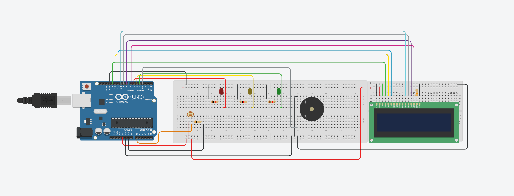
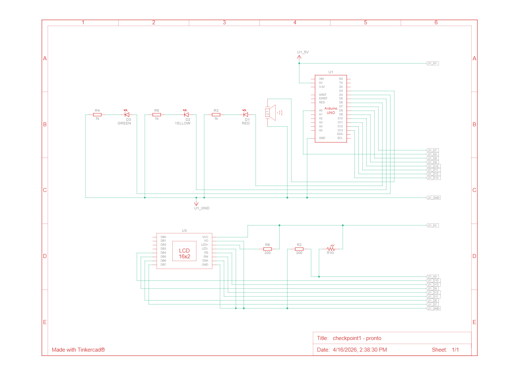

# 🍷 Vinheria Agnello — Monitor de Luminosidade

Sistema de monitoramento de luminosidade desenvolvido com Arduino para controle do ambiente de armazenamento de vinhos da **Vinheria Agnello**. O circuito detecta o nível de luz do ambiente e aciona alertas visuais (LEDs) e sonoros (buzzer) conforme a intensidade luminosa medida.

---

## 📋 Descrição do Projeto

O vinho é extremamente sensível à luz. A exposição excessiva pode degradar sua qualidade, alterando sabor e aroma. Este projeto tem como objetivo monitorar continuamente o nível de luminosidade do ambiente de armazenamento e alertar os responsáveis sempre que os níveis estiverem fora do ideal.

O sistema opera da seguinte forma:

- **LED Verde** → Luminosidade dentro do nível ideal (ambiente adequado para os vinhos)
- **LED Amarelo + Buzzer (3s)** → Luminosidade em nível de atenção (buzzer reativado se a condição persistir)
- **LED Vermelho + Buzzer contínuo** → Luminosidade acima do limite crítico (ação imediata necessária)

---

## 🛠️ Materiais Utilizados

| Quantidade | Componente               |
|:----------:|--------------------------|
| 1          | Placa Arduino ATmega 328P |
| 1          | Protoboard 800 pinos      |
| 1          | Protoboard 400 pinos      |
| 1          | Display LCD 16x2          |
| 1          | Sensor de luminosidade (LDR)|
| 1          | LED Verde                 |
| 1          | LED Amarelo               |
| 1          | LED Vermelho              |
| 1          | Buzzer                    |
| 3          | Resistor de 1kΩ           |
| 2          | Resistor de 330Ω          |
| 27         | Jumpers macho x macho     |

---

## 🔌 Pinagem

| Componente              | Pino Arduino |
|-------------------------|:------------:|
| LED Verde               | Digital 4    |
| LED Amarelo             | Digital 5    |
| LED Vermelho            | Digital 6    |
| Buzzer                  | Digital 3    |
| Display LCD (RS)        | Digital 13   |
| Display LCD (RW)        | Digital 12   |
| Display LCD (Enable)    | Digital 11   |
| Display LCD (D4)        | Digital 10   |
| Display LCD (D5)        | Digital 9    |
| Display LCD (D6)        | Digital 8    |
| Display LCD (D7)        | Digital 7    |
| Sensor de Luminosidade  | Analógico A0 |

---

## ⚙️ Lógica de Funcionamento

Os valores lidos pelo sensor analógico (0–1023) são convertidos para porcentagem (0–100%) e exibidos no display LCD. A lógica de alertas é baseada nos seguintes limites:

| Faixa (valor bruto do sensor) | Status         | LED Acionado | Buzzer                     |
|-------------------------------|----------------|:------------:|----------------------------|
| ≤ 10                          | ✅ Ideal        | Verde        | Desligado                  |
| Entre 50 e 200                | ⚠️ Atenção      | Amarelo      | Liga por 3 segundos        |
| ≥ 200                         | 🚨 Crítico      | Vermelho     | Liga continuamente (1000 Hz)|

> O buzzer é reativado a cada leitura enquanto a luminosidade permanecer em nível de atenção.

---

## 💻 Como Usar

1. Monte o circuito conforme o diagrama e a tabela de pinagem acima.
2. Abra o código-fonte no **Arduino IDE**.
3. Conecte a placa Arduino ao computador via cabo USB.
4. Selecione a placa **Arduino Uno** e a porta COM correta no menu *Ferramentas*.
5. Faça o upload do código para a placa.
6. Ao iniciar, o display exibirá a mensagem de boas-vindas **"Boas-Vindas! / Vinheria Agnello"** por 4 segundos.
7. Em seguida, o monitoramento começa automaticamente, exibindo o percentual de luminosidade no display e acionando os alertas conforme necessário.

---

## 🖼️ Diagrama do Circuito

## 🖼️ Diagrama Esquemático

---

|                                                  Link do diagrama                                                   |
|---------------------------------------------------------------------------------------------------------------------|
|https://www.tinkercad.com/things/aSuI1tmOPvF-checkpoint1-pronto?sharecode=636DqpF8hI5QYuFA9-YNbdCyn-g1G-2YinjtGQw_s_U|

---

|                                                 Vídeo de explicação                                                 |
|---------------------------------------------------------------------------------------------------------------------|
|https://youtu.be/qaIUkdj66ZM                                                                                         |
---
## 📦 Dependências

- [LiquidCrystal](https://www.arduino.cc/reference/en/libraries/liquidcrystal/) — Biblioteca nativa do Arduino IDE para controle do display LCD 16x2.

---

## 👥 Equipe

Projeto desenvolvido para a disciplina de **Edge Computing & Computer Systems** — FIAP.

|       nome:               |       RM:      |
|---------------------------|----------------|
|GIANLUCA ANTONICCI         |     570081     |
|MATHEUS MARCONDES ARAÚJO   |     573152     |
|ENZO VIEIRA PROVENZANO     |     569696     |
|JOÃO VITOR RODRIGUES COSTA |     569510     |
---

> *"A luz é inimiga do bom vinho. Proteja cada garrafa."*